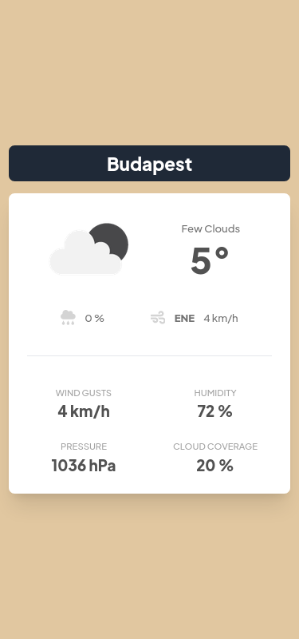
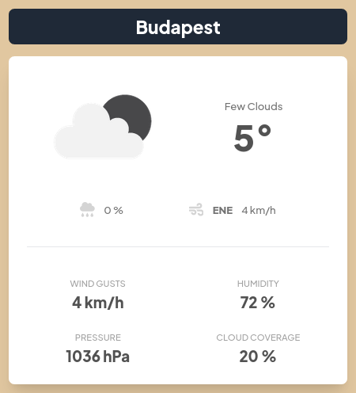

# Weather app

A simple and minimalistic weather app.  

## Table of contents

- [Overview](#overview)
  - [Screenshot](#screenshot)
    - [Mobile view](#mobile-view)
    - [Web view](#web-view)
- [Usage](#usage)
  - [Current location options](#current-location-options)
  - [Results](#results)
    - [Main](#main)
    - [Details](#details)
- [My process](#my-process)
  - [Built with](#built-with)
    - [Frontend](#frontend)
    - [Backend](#backend)
- [Todos after cloning](#todos-after-cloning)
- [Author](#author)

## Overview

### Screenshots

#### Mobile view


#### Web view


## Usage

Choose a location by clicking the button.

### Current location options

  - Budapest 
  - Győr
  - Debrecen
  - Miskolc
  - Pécs
  - Sopron
  - Szeged
  - Gyékényes

### Results 

#### Main

- Weather condition
- Current temperature
- Rain probability 
- Wind direction and speed 

#### Details

- Wind gusts 
- Humidity 
- Pressure 
- Cloud coverage

## My process

### Built with

#### Frontend
- [Vite](https://vitejs.dev/) - Frontend Tooling
- [React](https://reactjs.org/) - JS library
- [TailwindCSS](https://tailwindcss.com/) - CSS framework
- [tRPC](https://trpc.io/) - Typesafe endpoints for frontend and backend

#### Backend
- [ExpressJS](https://expressjs.com/) - NodeJS Backend framework
- [tRPC](https://trpc.io/) - Typesafe endpoints for frontend and backend
- [Zod](hhttps://zod.dev/) - TypeScript-first schema validation
- [Prisma](https://www.prisma.io/) - NodeJs and Typescript ORM 
- [Axios](https://axios-http.com/docs/intro) - HTTP Client

## Todos after cloning 

The /api directory needs a .env file with the following: 
- ```DATABASE_URL``` (path to the db, ```"file:./dev.db"``` by default)
- ```WEATHER_API_KEY``` (API key to [Openweather](https://openweathermap.org/))

## Author

- Website - [Gabor Jenei](https://gaborjenei.vercel.app/)
- Github - [@Morded](https://github.com/Morded)

